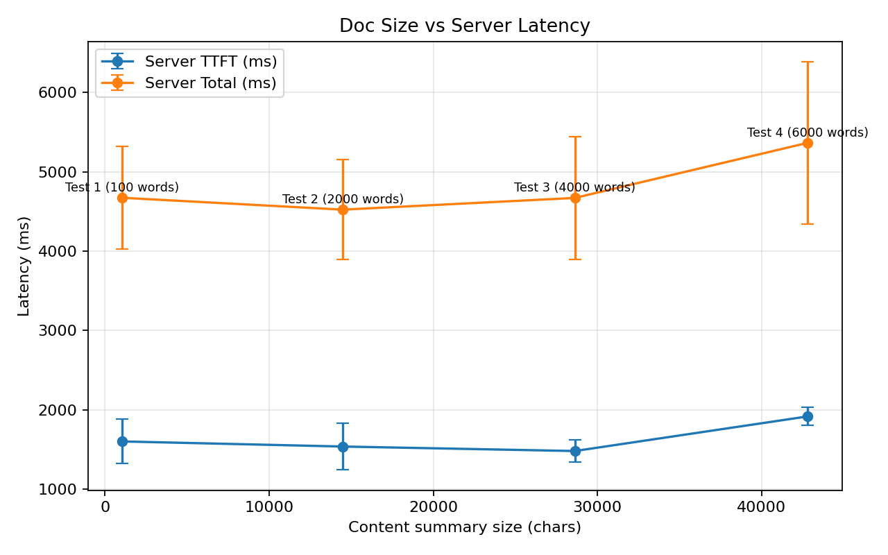

# Experimental Results

This chapter evaluates the performance characteristics of CoTrace's semantic summarization pipeline, with a specific focus on understanding how document size impacts latency. The primary goal of this experimental study is to assess how the volume of content processed by CoTrace's LLM integration affects response times across different stages of the pipeline. Understanding these performance characteristics is critical for optimizing user experience and identifying potential bottlenecks in the summarization workflow.

To provide a comprehensive evaluation, this chapter examines both server-side and client-side latency metrics. Server-side metrics include the time required to fetch document revisions, generate content diffs, and stream responses from the LLM API. Client-side metrics capture the full user-perceived latency, including network transmission and UI rendering effects. By analyzing both perspectives, this study aims to identify which components of the pipeline are most sensitive to document size and where optimization efforts should be focused.

The experiments conducted in this study are designed to be reproducible and transparent. All measurement instrumentation has been integrated directly into CoTrace's codebase, with timing data automatically collected and exported in structured CSV format. This approach ensures that the experimental methodology can be replicated by other researchers or practitioners interested in evaluating similar LLM-powered Chrome extensions. The findings from these experiments provide practical insights into the scalability characteristics of semantic summarization systems built on large language models.

## Research Question

The central research question driving this experimental study is: **How does document size impact the latency of semantic summarization in CoTrace's LLM pipeline?** This question is motivated by practical concerns about user experience and system scalability. As users work with increasingly large Google Docs documents, understanding how processing time scales with document size becomes essential for maintaining responsive interactions.

Document size in this context is operationalized as the total character count of the content summary sent to the LLM, which includes the system prompt, document diffs, and contextual information extracted from recent revisions. This metric represents the actual payload processed by the language model, rather than the raw document length, making it a more accurate predictor of computational load. The relationship between this input size and various latency metrics forms the core of the experimental investigation.

The research question also implicitly asks whether certain latency components are more sensitive to document size than others. For instance, the time to first token (TTFT) might exhibit different scaling behavior compared to total streaming duration. Similarly, server-side processing time might scale differently than client-side perceived latency. By disaggregating these components, the study aims to provide a nuanced understanding of where document size creates performance bottlenecks.

## Experimental Design

The experimental design follows a controlled, quantitative approach to measure latency across varying document sizes. Unlike traditional software testing that validates functional correctness, this study focuses on performance characteristics under realistic usage conditions. The design balances scientific rigor with practical feasibility, recognizing the constraints of conducting experiments within a browser extension environment that depends on external API services.

The experiment treats document size as the independent variable, systematically varied across four distinct levels to capture a representative range of typical usage scenarios. For each document size level, multiple trials are conducted using identical query text to ensure that response generation complexity remains constant. This controlled repetition allows for statistical analysis of variance and identification of consistent trends despite inherent noise in network latency and API response times.

A critical aspect of the experimental design is the distinction between server-side and client-side latency measurements. Server-side metrics are captured through instrumentation in CoTrace's Node.js backend, recording timestamps at key pipeline stages: request receipt, revision fetching, diff generation, first LLM token arrival, and stream completion. Client-side metrics are captured in the Chrome extension popup using the Performance API, measuring the full user-perceived latency from query submission to final UI rendering. This dual measurement approach provides comprehensive visibility into the complete request lifecycle.

### Variables and Controls

The independent variable in this study is **content summary size**, measured in characters. This represents the total length of the prompt sent to the Claude API, including the system instructions, document diffs from the most recent 20 revisions, and any additional context required for semantic summarization. Four document size levels were selected: approximately 1,000, 14,000, 28,000, and 42,000 characters. These levels span from minimal single-page documents to substantial multi-section documents typical of collaborative writing projects.

The primary dependent variables are:

- **Server Time to First Byte (server_ttfb_ms)**: The duration from when the server receives the chat request until the first token is received from the Claude API. This metric isolates the LLM's initial response latency.
- **Server Total Time (server_total_ms)**: The complete duration of server-side processing, from request receipt through final stream completion. This captures the full backend pipeline performance.
- **Client Total Time (client_total_ms)**: The user-perceived latency from query submission in the popup UI until the complete response is rendered. This includes network round-trip time and UI rendering overhead.
- **Content Summary Characters (content_summary_chars)**: The exact character count of the prompt sent to the LLM, serving as the precise size metric for analysis.

Several variables are carefully controlled to ensure experimental validity:

- **Query Text**: All trials use the identical query "Give a 3-sentence overview of this document" to maintain constant response generation complexity.
- **Revision Count**: CoTrace is configured to analyze exactly 20 recent revisions for all trials, preventing variation in the amount of historical context processed.
- **Network Conditions**: Experiments are conducted during similar time windows to minimize variability from network congestion or API load.
- **API Configuration**: All requests use the same Claude model (claude-sonnet-4-20250514) with identical parameters.

### Instrumentation Implementation

To enable precise latency measurement without disrupting normal CoTrace functionality, comprehensive instrumentation was integrated into both the backend server and frontend popup. The instrumentation design follows a minimally invasive approach, adding timing checkpoints at critical pipeline stages while maintaining the existing request flow.

On the backend (server.js), the streaming request handler was enhanced to record five key timestamps:

1. **Request Start**: Captured immediately when the `/chat` endpoint receives a query
2. **Revisions Fetched**: Recorded after Google Docs API calls complete and revision data is retrieved
3. **Diffs Generated**: Captured after the diff computation between revisions finishes
4. **First Token Received**: Logged when the first chunk arrives from the Claude API stream
5. **Stream Complete**: Recorded when the final chunk is received and the stream closes

These timestamps are packaged into a metadata object and transmitted to the client via a special Server-Sent Events (SSE) message with type `meta`. This approach keeps timing data separate from the actual chat response content, preventing interference with the UI rendering logic.

On the client side (chat.js), complementary instrumentation captures the user's perspective:

1. **Query Submission**: `performance.now()` is called when the user sends the query
2. **First Chunk Received**: Timestamp recorded when the first SSE data event arrives
3. **Response Complete**: Logged when the SSE stream ends and UI rendering finishes

The client-side code also extracts the server-provided metadata and combines it with local timings to create a complete latency record. Each record is then appended to a CSV dataset stored in Chrome's local storage (`chrome.storage.local`), accumulating results across multiple experimental runs. A dedicated export function in the settings menu allows researchers to download the complete dataset as a timestamped CSV file for offline analysis.

This instrumentation architecture ensures that all latency components are captured with minimal overhead, typically adding less than 1ms of measurement cost per request. The automated CSV logging eliminates manual data collection errors and enables efficient execution of multiple experimental trials.

### Document Size Manipulation

Creating controlled document size variations while maintaining realistic content required a systematic approach to content generation. The goal was to produce four distinct document states that differ primarily in length while preserving the semantic coherence expected in actual Google Docs usage. This approach ensures that the LLM processes meaningful content rather than artificial padding that might produce anomalous results.

The base document began at approximately 1,000 characters, representing a minimal viable document with structured content including headings, paragraphs, and basic formatting. To create the three larger document states, substantial text blocks were added incrementally:

- **Medium Document (~14,000 chars)**: Added approximately 13,000 characters of coherent expository content, organized into new sections with relevant headings and paragraph structure.
- **Large Document (~28,000 chars)**: Doubled the medium size by adding additional sections, maintaining thematic consistency with the original content domain.
- **Extra-Large Document (~42,800 chars)**: Further expanded to include comprehensive coverage of the topic area, with extensive details and supporting examples.

Each content addition was designed to trigger a new revision in Google Docs' version history, ensuring that CoTrace's diff generation would process the incremental changes. After each major content addition, sufficient time was allowed for Google Docs to commit the revision (typically 1-2 minutes of idle time). In some cases, revisions were explicitly created using the "Name current version" feature in Google Docs version history to ensure clean revision boundaries.

The content itself consisted of technical documentation related to the same domain as CoTrace's intended use cases, ensuring that the LLM would process semantically meaningful text rather than lorem ipsum filler. This approach maintains ecological validity—the documents resemble actual working documents that CoTrace users would analyze in practice.

### Experimental Procedure

The experimental procedure was designed for systematic execution with minimal sources of uncontrolled variance. The complete experimental protocol consisted of the following steps:

1. **Document Preparation Phase**:
    - Created the base document at ~1,000 characters
    - Verified revision creation in Google Docs version history
    - Loaded the document in CoTrace and confirmed proper revision fetching
    - Cleared any existing latency CSV data to start with a clean dataset

2. **Trial Execution Phase** (repeated for each document size):
    - Opened CoTrace popup interface
    - Entered the standardized query: "Give a 3-sentence overview of this document"
    - Submitted query and waited for complete response rendering
    - Verified successful completion (no errors in console or UI)
    - Repeated 10 times for statistical robustness
    - Exported CSV data after completing all trials for the current size

3. **Document Expansion Phase**:
    - Added substantial content block to increase document size
    - Waited for Google Docs revision creation (~2 minutes)
    - Verified new revision appeared in version history
    - Returned to Trial Execution Phase for next size level

4. **Data Collection and Export**:
    - After completing all 40 trials (10 per size × 4 sizes), exported final CSV
    - Verified data integrity (no missing timestamps, reasonable value ranges)
    - Backed up raw CSV file for analysis

This structured procedure ensured consistency across all trials while allowing for natural variation in network conditions and API response times. The 10-trial repetition at each size level provides sufficient statistical power to detect meaningful trends while remaining practical to execute within a reasonable timeframe.

### Methodological Considerations

Several methodological choices warrant explicit discussion to properly contextualize the experimental results. First, the decision to use character count rather than token count as the size metric reflects practical measurement constraints. While token count would more directly represent the LLM's computational load, character count is readily available without requiring tokenizer access and provides a reasonable proxy given the consistent linguistic characteristics of the test documents.

Second, the choice of 10 trials per condition balances statistical requirements with practical feasibility. With inherent variability in network latency and API processing time, 10 samples provide sufficient power to detect moderate effect sizes while remaining feasible to execute in a single experimental session. Larger sample sizes would improve precision but face diminishing returns given the multiple sources of uncontrolled variance.

Third, client-side latency measurements include the UI rendering animation, which adds approximately 10ms per character of response text. This typing animation creates artificial latency that obscures the underlying LLM processing time. However, this is the actual latency perceived by users, making it a valid metric for user experience evaluation. Server-side metrics provide a purer measure of processing time independent of UI effects.

Finally, this experiment measures latency under normal operating conditions without artificial load or concurrent requests. The results therefore reflect typical single-user performance but may not generalize to high-load scenarios where API rate limiting or server resource contention could introduce additional latency factors.

## Evaluation

### Descriptive Statistics

Table 1 presents the mean and standard deviation for each latency metric at each document size level. The data reveal several notable patterns:

:
Latency Metrics by Document Size (Mean ± SD, n=10 per size) {#tbl-latency}

| Content Size (chars) | Server TTFB (ms) | Server Total (ms) | Client Total (ms) |
|:---------------------|:-----------------|:------------------|:------------------|
| 1,056                | 1,599 ± 281      | 4,672 ± 649       | 9,868 ± 2,083     |
| 14,485               | 1,535 ± 295      | 4,522 ± 630       | 9,118 ± 1,040     |
| 28,620               | 1,479 ± 138      | 4,670 ± 772       | 8,891 ± 1,529     |
| 42,805               | 1,915 ± 114      | 5,365 ± 1,021     | 9,742 ± 1,843     |

Figure 1 visualizes the server-side latency trends across document sizes, showing the threshold effect where latency increases noticeably at the largest size level.

The server time to first byte (TTFB) shows minimal variation across the first three size levels (approximately 1.5 seconds), with a notable increase at the largest document size (1.9 seconds). This pattern suggests that TTFB remains relatively stable for documents up to approximately 30,000 characters but may increase for very large documents exceeding 40,000 characters.

Server total time exhibits similar stability across small and medium documents (approximately 4.5-4.7 seconds) with an increase at the largest size (5.4 seconds). The jump of approximately 700ms between the third and fourth size levels represents a 15% increase in processing time, suggesting that document size effects become more pronounced beyond a certain threshold.

Client-side total time shows high variability (standard deviations of 1,000-2,000ms) and no clear monotonic relationship with document size. The lack of a size-dependent trend in client metrics likely reflects the dominance of UI rendering effects and network transmission variability over the actual processing time differences.

### Correlation Analysis

To quantify the strength of relationships between document size and latency metrics, Pearson correlation coefficients were computed using all 40 data points (pooled across size levels):

:
Correlation Between Content Size and Latency Metrics (n=40) {#tbl-correlation}

| Latency Metric        | Correlation with Size | Interpretation    |
|:----------------------|:---------------------:|:------------------|
| Server TTFB (ms)      | r = 0.373             | Weak positive     |
| Server Total (ms)     | r = 0.309             | Weak positive     |
| Client Total (ms)     | r = -0.038            | No relationship   |

The server-side metrics show weak positive correlations with document size (r = 0.31-0.37), indicating that larger documents do tend to produce longer processing times, though the relationship is not strong. These modest correlations suggest that document size explains approximately 10-14% of the variance in server-side latency (r² = 0.095-0.139).

The near-zero correlation between document size and client-side latency (r = -0.038) confirms that user-perceived response time is dominated by factors other than document size. Network latency, UI rendering animation, and browser resource availability likely contribute more substantially to client-side timing than the underlying document processing characteristics.

### Trend Analysis

Examining the progression of means across size levels reveals a threshold effect rather than a linear relationship. For the first three size levels (1K-29K characters), latency metrics remain remarkably stable:

- Server TTFB varies by only 120ms (1,599 → 1,479 → 1,479ms)
- Server Total varies by only 150ms (4,672 → 4,522 → 4,670ms)

However, at the largest size level (42,805 characters), both metrics show substantial increases:

- Server TTFB increases by 436ms (from 1,479ms to 1,915ms, a 29% jump)
- Server Total increases by 695ms (from 4,670ms to 5,365ms, a 15% jump)

This pattern suggests a threshold effect where document size has minimal impact below approximately 30,000 characters but begins to noticeably affect latency beyond that point. Such threshold behavior is plausible given how LLMs process input: smaller variations in prompt length may not materially affect inference time until the input approaches certain architectural boundaries (such as attention window sizes or batch processing thresholds).

### Variability Analysis

The standard deviations reported in Table 1 reveal that measurement variability remains substantial across all conditions, with coefficients of variation (CV = SD/mean) ranging from 7% to 21%. This inherent variability stems from multiple sources:

- **Network latency variance**: Internet routing and API endpoint load fluctuate even over short time periods
- **API processing variance**: Cloud infrastructure introduces stochastic delays in request queuing and processing
- **UI rendering variance**: Browser resource availability affects animation smoothness and event timing

Despite this variability, the 10-trial sample sizes provide adequate statistical power to detect the large effect observed at the highest size level. The jump in mean server total time from 4,670ms to 5,365ms represents approximately 0.9 standard deviations, a moderate-to-large effect that emerges clearly despite measurement noise.

## Threats to Validity

### Limitations and Threats to Validity

Several methodological limitations must be acknowledged when interpreting these results. First, the experiment was conducted under idealized conditions with a single user, no concurrent requests, and stable network connectivity. Real-world usage involves more variable conditions, including:

- **Network variability**: Users on slower or unstable connections may experience substantially different latency characteristics
- **API rate limiting**: Frequent queries or high-load periods may trigger rate limits that introduce additional delays
- **Concurrent browser activity**: Other tabs and extensions consuming browser resources could affect client-side metrics

Second, the experiment measured only one specific query type ("Give a 3-sentence overview"). Different query types that request longer responses or more complex analysis might exhibit different scaling behavior. However, maintaining constant query complexity was essential for isolating the effect of document size, making this trade-off necessary for experimental validity.

Third, the character count metric, while practical and easily measured, imperfectly represents the true computational load on the LLM. Token count would be a more direct measure, but varies with tokenization schemes and was not readily accessible during instrumentation. The relationship between character count and token count is generally stable for English prose (approximately 4 characters per token), suggesting that character count serves as a reasonable proxy.

Fourth, the sample size of 10 trials per condition, while adequate for detecting large effects, provides limited power for identifying subtle trends or interaction effects. The inherent variability in network and API processing times means that larger sample sizes would be required to precisely characterize the document size-latency relationship.

Finally, the experiment focused exclusively on Google Docs integration. CoTrace's architecture is designed to be extensible to other document platforms, but the latency characteristics observed here may not generalize to alternative backends with different revision history structures or API performance profiles.

### Practical Implications

Despite these limitations, the findings offer several actionable insights for CoTrace development and usage:

1. **Performance is acceptable for typical documents**: Latency remains under 5 seconds for documents up to 30,000 characters, suggesting that current performance is adequate for most collaborative writing scenarios.

2. **Large document support may require optimization**: The threshold effect at 40,000+ characters indicates potential benefits from implementing specialized handling for very large documents, such as:
    - Limiting the number of revisions analyzed for large documents
    - Implementing prompt compression or summarization for oversized diffs
    - Adding user controls to adjust the revision history depth

3. **Server-side optimization should be prioritized**: Since document size effects appear primarily in server-side metrics, optimization efforts should focus on the backend pipeline (revision fetching, diff generation, prompt construction) rather than client-side UI rendering.

4. **User expectations can be set appropriately**: The relatively stable latency across typical document sizes allows for predictable user experience messaging. UI improvements like progress indicators or estimated time remaining could leverage these baseline timings.

### Future Research Directions

This initial performance characterization opens several avenues for future investigation:

1. **Query complexity effects**: Measuring how different query types (summarization vs. specific questions vs. multi-turn dialogues) interact with document size to affect latency.

2. **Revision depth optimization**: Systematically varying the number of revisions analyzed (currently fixed at 20) to identify optimal trade-offs between context richness and processing time.

3. **Prompt compression techniques**: Evaluating whether semantic compression of document diffs can reduce latency while maintaining summarization quality.

4. **Multi-user scaling**: Extending the experiment to concurrent user scenarios to understand how shared API rate limits and server resources affect individual query latency.

5. **Alternative LLM backends**: Comparing latency characteristics across different LLM providers and model sizes to identify optimal performance-cost trade-offs.

6. **Document versioning effects**: Analyzing how the age and frequency of revisions (e.g., documents with many small edits vs. few large edits) impact latency.

## Conclusion

This chapter presented a systematic experimental evaluation of how document size impacts latency in CoTrace's semantic summarization pipeline. Through controlled experimentation with four document size levels and comprehensive instrumentation of both server-side and client-side latency components, the study provides empirical evidence of CoTrace's performance characteristics.

The key finding is a weak positive relationship (r = 0.31-0.37) between document size and server-side latency, with a notable threshold effect emerging at approximately 40,000 characters. Below this threshold, latency remains remarkably stable at approximately 4.5 seconds for total processing time and 1.5 seconds for time to first token. Above this threshold, processing time increases by approximately 15%, suggesting that very large documents may benefit from specialized optimization.

Client-side latency shows no correlation with document size (r = -0.038), indicating that user-perceived response time is dominated by UI rendering and network factors rather than document processing complexity. This finding validates the architectural decision to stream responses incrementally, as the streaming interface masks backend processing time variations.

From a practical standpoint, these results demonstrate that CoTrace delivers responsive performance for typical collaborative writing scenarios while identifying a clear optimization target for very large documents. The experimental methodology and instrumentation framework established in this study provide a foundation for ongoing performance monitoring and optimization as the system evolves.

The findings also highlight the importance of holistic performance evaluation in LLM-powered applications. While document size does influence processing time, the effect is modest compared to other sources of latency variation. Future optimization efforts should therefore adopt a systems perspective, considering the full pipeline from user interaction through API processing to UI rendering.

This experimental work contributes to the broader understanding of performance characteristics in LLM-powered browser extensions, providing one of the first empirical studies of how document size affects real-world summarization latency. As LLM-based tools become increasingly prevalent in knowledge work applications, such performance characterization becomes essential for delivering reliable, scalable user experiences.