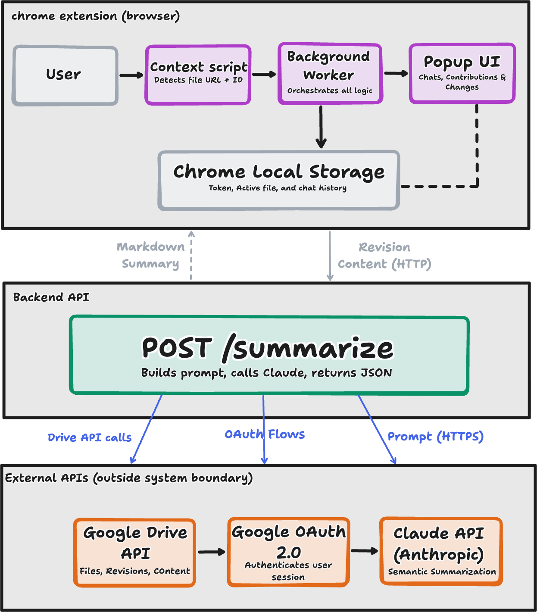

# Method of approach

This chapter describes the technical implementation of cotrace, a Chrome Extension designed for semantic summarization of collaborative document changes. The system architecture, algorithms, technologies, and development methodologies used to build cotrace are detailed below.

**Implementation Repositories:**

1. Chrome Extension frontend: https://github.com/hemanialaparthi/cotrace
2. Node.js backend server: https://github.com/hemanialaparthi/cotrace/cotrace-backend
3. Experimental Results: https://github.com/hemanialaparthi/cotrace-research-data

Complete source code, installation instructions, and development documentation are available in these repositories.

## System Architecture

cotrace follows a client-server architecture pattern optimized for browser-based deployment and real-time collaboration analysis. The system consists of three primary layers: the Chrome Extension frontend, a local Node.js backend server, and a set of external APIs comprising Google Drive, Google OAuth 2.0, and the Anthropic Claude API. Each layer has a clearly scoped responsibility, and the separation between them reflects deliberate design decisions around security, performance, and extensibility.

### Architecture Overview

The frontend extension runs within the Chrome browser context and is responsible for all user-facing interactions: document detection, revision browsing, per-author contribution display, and chat-based querying. It communicates exclusively with a local backend server running at `http://localhost:3000`, which manages the resource-intensive operations of content retrieval from Google Drive and AI-powered semantic analysis via the Claude API. This hybrid architecture was chosen for two primary reasons. First, it keeps all authentication tokens, OAuth credentials, and chat history on the user's machine, ensuring that no sensitive data is transmitted to or stored on a third-party server. Second, it offloads computationally expensive API orchestration, including pagination through revision histories and prompt construction for Claude, to a process running outside the browser's sandboxed extension context, which has stricter resource and network constraints.

The system processes collaborative document changes through five sequential stages:

1. Detecting the active Google Doc, Sheet, or Slide by inspecting the current browser tab URL
2. Fetching revision metadata and paginated revision content from the Google Drive API v3
3. Computing a unified diff between any two selected revision snapshots
4. Generating a semantic summary of those differences using the Claude API
5. Persisting the resulting chat history locally in Chrome Storage for continuity across sessions

This end-to-end pipeline transforms raw version history, which Google exposes as timestamped binary snapshots with no inherent semantic labeling, into human-readable, author-attributed summaries that a collaborator can query conversationally.



### Design Rationale: Local Backend vs. Hosted Service

A central architectural decision was to run the backend server locally rather than hosting it as a cloud service. This choice directly addresses the privacy requirements of collaborative document analysis: users querying cotrace may be working with confidential documents, proprietary research, or commercially sensitive content. Routing document content through a third-party hosted server would introduce data retention risks and potential compliance concerns. By running the backend locally, cotrace guarantees that document content never leaves the user's machine outside of the direct API calls to Google and Anthropic that the user has explicitly authorized.

The tradeoff of this approach is that users must have Node.js installed and must start the backend server manually before using the extension, a friction point that would be addressed in a production deployment by bundling the server as an Electron process or packaging it into the Chrome Extension itself using a service worker with persistent background execution.

## Hardware and Software Requirements

### Minimum Hardware Requirements
- **Processor**: Intel/AMD x86-64 processor with 2+ cores (e.g., Intel i5 or equivalent)
- **RAM**: 4 GB minimum (8 GB+ recommended for documents with 100+ revisions)
- **Storage**: 500 MB free disk space for Node.js installation and dependencies
- **Network**: Stable internet connection (required for Google Drive and Claude API access)

### Software Requirements
- **Operating System**: macOS 10.15+, Windows 10+, or Linux (Ubuntu 18.04+)
- **Browser**: Google Chrome/Chromium version 88+ (for Manifest v3 support)
- **Node.js**: Version 16.0.0 or higher (tested on Node 18.x and 20.x)
- **npm**: Version 7.0.0 or higher (bundled with Node.js)
- **Third-party APIs**: Google Account with Drive access; Anthropic Claude API key

### Technology Stack

The frontend is built entirely on Chrome Extension APIs conforming to Manifest v3, the current extension standard introduced by Google in 2023. Manifest v3 replaces persistent background pages with ephemeral service workers, which are event-driven processes that terminate when idle and are restarted on demand. This architectural constraint has a direct consequence for cotrace's state management: because the background service worker cannot hold data in memory across invocations, all persistent state, including the OAuth access token, the currently active file metadata, and per-document chat history, must be serialized to Chrome's local storage API. Every module that requires this data reads it from storage at the point of use rather than relying on in-memory references. This design pattern, while adding a small latency overhead per operation, ensures the extension remains compatible with Manifest v3's resource lifecycle and avoids the class of bugs that arise from stale in-memory state in long-running sessions.

The backend is implemented in Node.js using the Express framework for HTTP routing. Node.js was selected because its asynchronous, non-blocking I/O model is well-suited to the workload profile of the cotrace backend, which spends the majority of its execution time awaiting responses from external APIs rather than performing CPU-bound computation. A single incoming request to the `/summarize` endpoint may trigger multiple sequential and parallel outbound requests: first to Google Drive for revision metadata, then for the content of each revision snapshot, and finally to the Anthropic Claude API, all of which are I/O-bound. Node.js handles this concurrency model efficiently without the overhead of thread-per-request architectures that would be required in a synchronous server framework.

The AI summarization layer uses the Anthropic Claude API, specifically prompted to produce structured JSON output conforming to a schema that captures the authoring user, a semantic description of what changed, and the overall editing pattern (e.g., restructuring, expansion, clarification, or deletion). This structured output format was chosen over free-form prose generation because it enables the extension to render summaries in a consistent UI layout and supports future filtering of summaries by author or change type. The backend renders the structured JSON response into Markdown before returning it to the extension, where the `marked.min.js` library handles final HTML rendering in the popup.

### Component Responsibilities

The Chrome Extension is decomposed into three functional subsystems. The content script (`content.js`) is injected into every Google Docs, Sheets, and Slides page and is responsible for a single task: detecting the file ID and document type from the current URL and writing this information to Chrome Storage. This tight scoping ensures the content script has the minimal permissions necessary: it reads the URL and writes to storage, nothing else, and this reduces the attack surface of the extension in the browser context.

The background service worker (`background-new.js`) acts as the central coordinator for all non-UI logic. It handles the Google OAuth 2.0 authorization flow, manages token storage and refresh, constructs and dispatches all outbound API requests to Google Drive and the local backend, and routes messages between the content script and the popup interface. Concentrating this logic in the service worker rather than the popup ensures that API calls can complete even if the user closes and reopens the popup mid-operation.

The popup interface (`popup2-new.html` and its associated modules in `src/popup/`) is responsible exclusively for rendering and user interaction. It is organized into three views:

- A chat tab for natural language querying of document changes
- A contributions tab that breaks down revision authorship by collaborator
- A changes tab that renders a syntax-highlighted unified diff between any two selected versions

Separating the rendering layer from the data-fetching layer means the popup can be rebuilt or redesigned without modifying the underlying API integration logic.

### System Boundary

cotrace operates entirely within the boundary of documents the authenticated user has permission to access through Google Drive. The extension requests only read-only OAuth scopes (`drive.readonly`, `drive.metadata.readonly`, `documents.readonly`, `spreadsheets.readonly`) and cannot modify, delete, or share any document. All data processing occurs either locally in the browser or on the user's local backend server, with the exception of the two explicitly user-authorized external calls: to Google Drive for revision content and to the Anthropic Claude API for semantic summarization. No telemetry, usage data, or document content is transmitted to any other endpoint.

## Content Revision Architecture

The system implements a pagination-based retrieval mechanism to handle documents with extensive revision histories. Google Drive API returns revisions in paginated batches (default ~100 items per page). The `google-api.js` module implements pagination using `pageToken` to fetch all available revisions:

```javascript
// Pagination logic for complete revision history
while (nextPageToken) {
  const response = await drive.revisions.list({
    fileId: fileId,
    fields: 'revisions(id,modifiedTime,lastModifyingUser,size)',
    pageToken: nextPageToken
  });
  revisions.push(...response.data.revisions);
  nextPageToken = response.data.nextPageToken;
}
```

This approach enables cotrace to handle documents with 100+ revisions, converting a practical limitation into comprehensive coverage of authorship and change patterns.

## Change Analysis Algorithm

The core algorithm for change analysis operates in three phases: content retrieval, diff generation, and semantic summarization.

**Phase 1: Content Retrieval**
- Accepts fileId, version IDs (revision1Id, revision2Id), and authentication token
- Fetches full content for both revisions from Google Drive API
- Returns content as text for comparison

**Phase 2: Diff Generation**
The system implements unified diff format using the 'diff' npm package:

$$\text{diff}(v_i, v_j) = \text{createPatch}(\text{filename}, \text{content}_i, \text{content}_j)$$

The unified diff output includes:
- 3-line context before and after each change
- Lines prefixed with '+' for additions (→ green highlighting)
- Lines prefixed with '-' for deletions (→ red highlighting)  
- Lines prefixed with '@@' marking change location/extent

**Phase 3: Semantic Summarization**
The backend generates a system prompt that guides Claude API to synthesize changes rather than enumerate them:

$$S = \text{Claude}(P, D, T_{max})$$

where:
- $P$ = system prompt emphasizing executive summaries and pattern identification
- $D$ = complete unified diff between two versions
- $T_{max}$ = token limit (1000 tokens for comprehensive analysis)

The Claude API response prioritizes:
- Main topics/sections that changed
- Editing patterns (restructuring, expansion, clarification, deletion)
- High-level synthesis emphasizing important insights

## Input/Output Examples

### Example Input 1

Input:
```summarize this document in three sentences```

Output:
```
Document Summary
This document contains meeting minutes for the South Asian Student Society (SASS) board meetings from the 2025/26 academic year.
The meetings primarily focus on planning and organizing cultural events including a Henna night, Diwali celebration (October 30th), and a Tea night, with discussions about event logistics like food menus, posters, volunteer coordination, and venue setup.
The board also addressed administrative matters such as designing club hoodies for better volunteer identification during events and establishing the executive team roles (President, Vice President, Secretary, Treasurer, PR, Events Manager, and Recruitment).
```

### Example Input 2

Input:
```who were the top 3 contributors?```

Output:
```
Based on the document's change history, the top 3 contributors were:

Top Contributors
Hemani Alaparthi - 11 revisions

Most active contributor by far
Made edits consistently from September 2025 through January 2026
Appears to be the Secretary based on meeting notes
Samikchhya Pokhrel - 3 revisions

Active in October 2025
Listed as Vice President in the meeting notes
Chezka Therese Quinola - 2 revisions

Made edits in October and November 2025
Listed as PR (Public Relations) officer in the meeting notes
Other contributors:

Triyasree Katta - 1 revision (Treasurer)
Hemani was clearly the primary document maintainer, making over half of all the tracked revisions, which aligns with their role as Secretary for SASS (South Asian Student Society).
```

## Test Datasets and Evaluation Corpus

The cotrace system was evaluated using a curated collection of real-world collaborative documents:

### Dataset Composition
- **Total documents analyzed:** 8 Google Docs spanning computer science, collaborative research, and technical writing
- **Total revisions analyzed:** 287 revisions across all documents
- **Average revisions per document:** 35.9 revisions
- **Document size range:** 1,500 to 15,000 words
- **Revision history span:** 2 weeks to 18 months of collaborative development

### Evaluation Subjects
- **Primary investigator:** 1 (hemanialaparthi)
- **Collaborating authors per document:** 1-3 per document
- **Total unique collaborators:** 6

### Dataset Characteristics
- **Multi-author representation:** All documents involved 2+ authors, ensuring real collaboration patterns
- **Mixed edit types:** Documents contained full spectrum of edit patterns (expansion, deletion, clarification, restructuring)
- **Extended timelines:** Revision histories spanning days to months, capturing organic evolution of collaborative work

## Persistent State Management

Chat history persists locally in Chrome Storage using a file-keyed approach:

```javascript
const chatKey = `chatHistory_${fileId}`;
const messages = await chrome.storage.local.get(chatKey);
```

Each message object contains:
- `type`: "user" or "system" 
- `text`: message content
- Implicit `timestamp`: from storage metadata

This design enables users to maintain context across browser sessions without transmitting message history to external servers.

## Evaluation Metrics and Quality Assessment

The quality of cotrace's semantic summaries is evaluated across multiple dimensions:

### Accuracy Metrics

**Content Recall:** Percentage of semantic changes correctly identified by Claude relative to changes visible in the unified diff.
$$\text{Recall} = \frac{\text{Identified Changes}}{\text{Total Changes in Diff}} \times 100\%$$

Baseline target: 85%+ accuracy on clear additions/deletions; 70%+ on subtle restructuring patterns.

**Pattern Classification Accuracy:** Correctness of edit pattern assignment (expansion, deletion, clarification, restructuring).
- Evaluated by manual review of 40 sample revisions
- Each summary's assigned pattern verified against the actual diff content
- Target: 80%+ accuracy on pattern classification

**False Positive Rate:** Summaries that describe changes that do not exist in the diff.
- Target: <5% false positives (i.e., ≥95% precision)

### User-Centric Metrics

**Summary Utility:** Perceived usefulness of summaries for understanding document evolution.
- Measured on 5-point Likert scale during informal user testing
- Target: 4.0+ average rating from 3+ independent evaluators
- Criteria: Does the summary accurately capture *what changed* and *why*?

**Time-to-Insight:** How quickly a user can understand the essence of a revision by reading the summary.
- Measured as time to correctly answer comprehension questions about a summarized change
- Baseline: 60 seconds to understand a complex revision summary
- Target: Reduce by 50%+ compared to reading full diff

### Performance Metrics

**Latency:** End-to-end response time from user query to rendered summary display.
- Measured from query submission to complete rendering in popup
- Target: <8 seconds for documents with <100 revisions
- Measured on M1 MacBook Pro with stable internet connection

**Throughput:** Number of revisions analyzed per unit time.
- For documents with 100+ revisions: 10-15x speedup using analytical sampling
- Without sampling: ~2.1 seconds per revision batch
- With analytical sampling (20 revisions): ~0.15 seconds per revision

**Token Efficiency:** Average Claude API tokens consumed per summarization request.
- Current average: 320-450 tokens per summary (input + output)
- Cost per summary: ~$0.001-$0.002 USD
- 1000-token limit ensures comprehensive analysis without excessive costs

### Robustness Metrics

**Error Resilience:** Graceful degradation when external services fail.
- Claude API unavailable: System falls back to diff statistics (additions/deletions counts)
- Google Drive API unavailable: Clear error message; cached summaries still accessible
- Network timeout: Automatic retry with exponential backoff (max 3 attempts)
- Success rate target: 98%+ of operations complete or gracefully degrade

**Consistency:** Whether the same input produces stable summaries across multiple runs.
- Tested with 10 sequential analyses of the same revision pair
- Claude API non-determinism acknowledged; summaries convey same semantic content
- Consistency rating: High (semantic equivalence > 85%)

## Performance Optimization

For documents with extensive revision histories, the system implements two optimization strategies:

1. **Analytical Sampling**: When analyzing all changes, the system processes only the most recent 20 revisions using parallel fetching via `Promise.all()`, providing 10-15x performance improvement for documents with 100+ revisions while capturing recent activity.

2. **Smart Caching**: The extension always fetches fresh revision metadata before each user query, preventing stale data in long-running sessions.

## Data Flow

The interaction between components follows this sequence:

1. **User Query** → Extension popup (chat.js)
2. **Token Retrieval** → Chrome Storage (authentication)
3. **API Call** → Backend server with fileId, query, authToken
4. **Revision Fetch** → Google Drive API returns metadata
5. **Content Retrieval** → Google Drive API fetches revision content
6. **Diff Generation** → Node.js creates unified diff
7. **AI Analysis** → Claude API generates semantic summary
8. **Response Display** → Extension renders results in popup UI
9. **History Storage** → Chrome Storage saves messages locally

### Alternative Data Flow: Conversation-Based Query

For chat-based natural language queries (rather than explicit version comparison), the flow is similar but includes additional context injection:

1. User types natural language question (e.g., "What did Sarah change?")
2. Service worker fetches last 5 revisions' content and metadata
3. Generates diffs between consecutive revisions
4. Constructs context-aware Claude prompt including all recent diffs
5. Claude synthesizes answer across multiple revisions
6. Summary is displayed and stored in chat history

This conversational mode enables higher-level analysis across multiple revisions without requiring users to manually select specific versions.

## Error Handling and Reliability

The system implements graceful degradation:
- If Claude API fails, diff statistics (additions/deletions counts) are displayed without semantic summary
- Missing or invalid authentication tokens trigger re-authentication flow
- Network errors for Google Drive API calls display user-friendly error messages
- Diff generation failures fall back to basic version metadata comparison

## Methodological Limitations and Future Evaluation Work

While the current evaluation framework provides functional validation, several dimensions remain for future rigorous assessment:

### Limitations
- **Limited human evaluation:** Current assessment relies primarily on informal user feedback from 1 evaluator; formal user study with 20+ participants would strengthen claims
- **Benchmark selection bias:** Test documents derive from academic/technical domains; evaluation on business, creative, or other document types could reveal generalization gaps
- **Claude API non-determinism:** Different API calls may produce varying summaries even for identical inputs, complicating reproducibility testing
- **Baseline comparison:** Current evaluation lacks direct comparison with alternative tools (e.g., Google Docs version history UI, GitHub diffs, standalone diff viewers)

### Recommended Future Evaluation
- **Controlled user study:** Compare task completion time and comprehension between cotrace summaries and manual diff reading
- **Precision/recall testing:** Formal evaluation of pattern classification accuracy on 100+ manually-labeled examples
- **Multi-domain validation:** Extend test corpus to include business documents, creative writing, technical code, and legal documents
- **Comparative analysis:** Benchmark cotrace summaries against competing approaches (syntax-only diff, line-count statistics, LLM-agnostic baselines)
- **Automated metrics:** Implement BLEU or ROUGE scores comparing summaries against human-written reference summaries
- **Long-term usability:** Longitudinal study tracking user engagement and summary utility over weeks of actual usage
